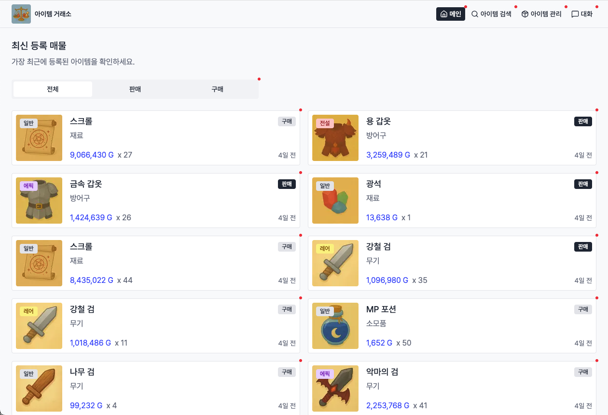
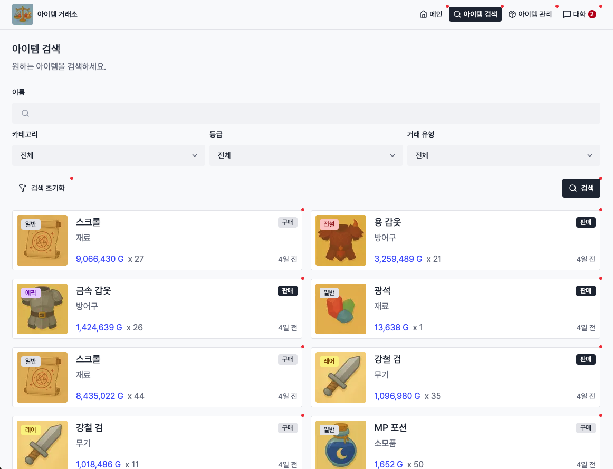
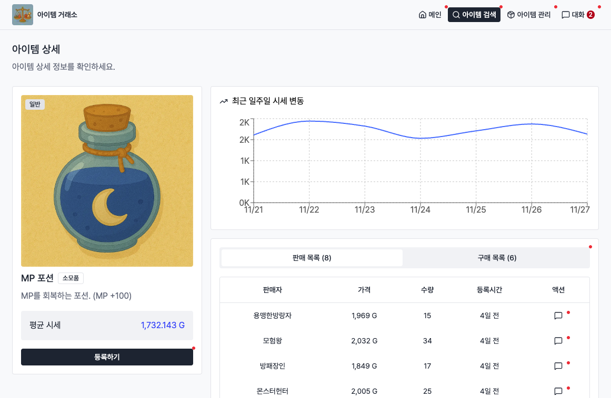
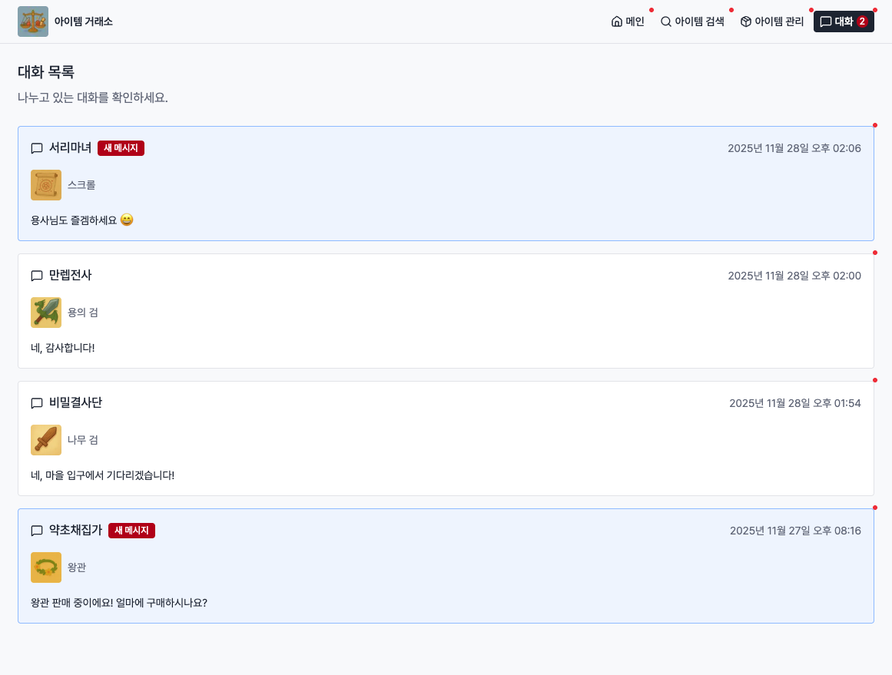
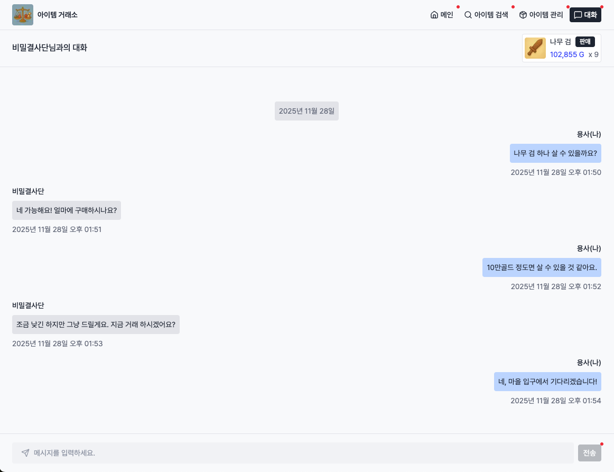
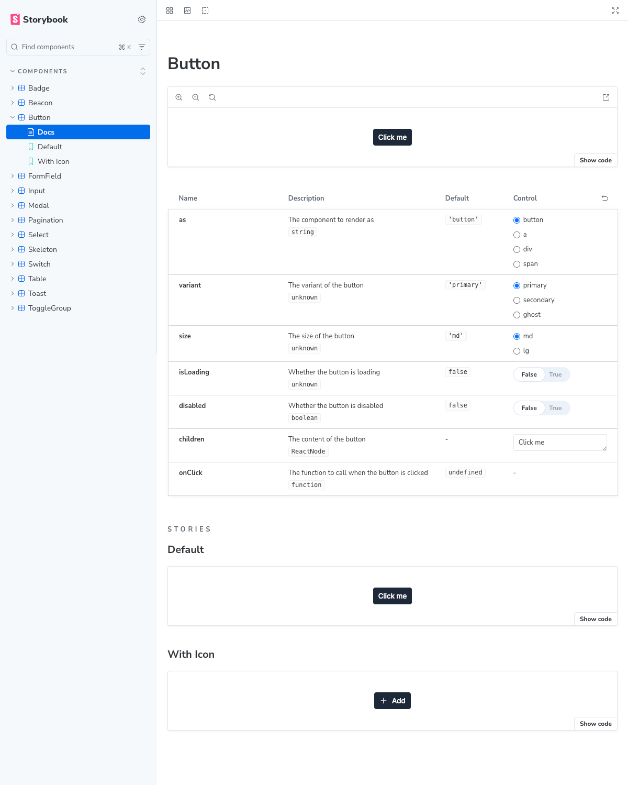
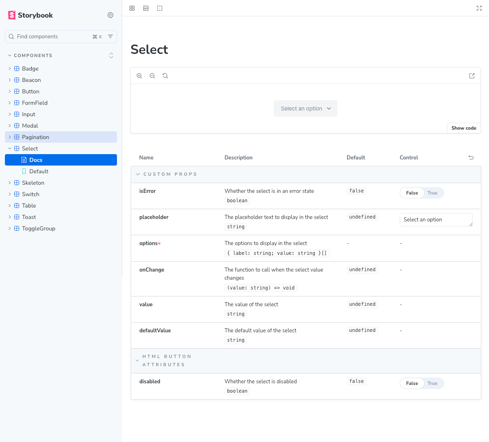
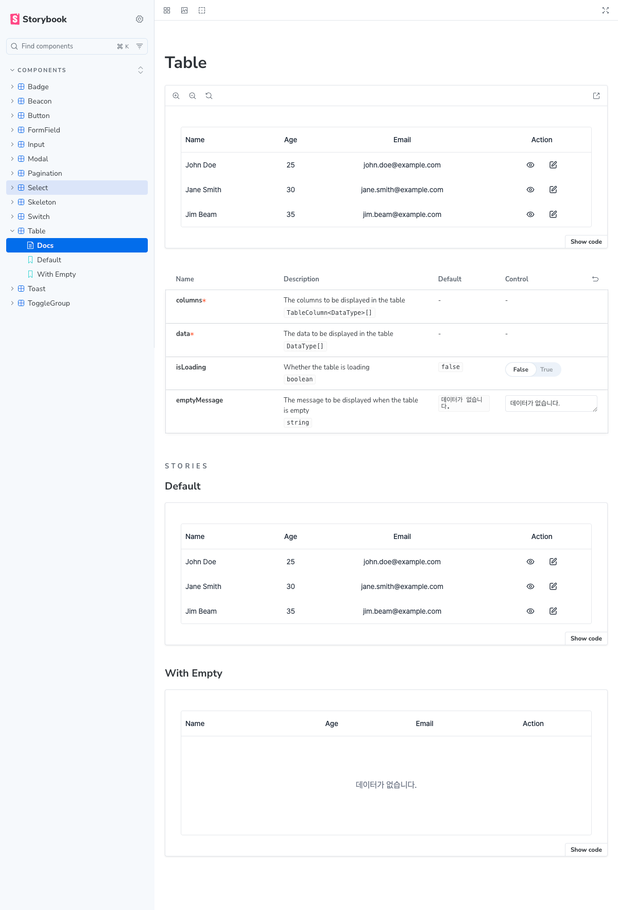

# 포트폴리오

다양한 웹 서비스의 UI를 모아 구성한 포트폴리오입니다.

각 서비스의 대표 UI를 구현하고 핵심 구현 포인트를 문서화합니다.

## 목차

[1. 관리자 시스템(어드민) 웹](#관리자-시스템어드민-웹)

[2. 아이템 거래소 웹](#아이템-거래소-웹)

[3. 공통 UI 패키지](#공통-ui-패키지)

## 프로젝트

### 관리자 시스템(어드민) 웹

[🔗 사이트 바로가기](https://portfolio-admin-silk.vercel.app/)

[🔗 코드 바로가기](https://github.com/eo9on9/portfolio/tree/main/apps/admin)

---

### 아이템 거래소 웹

[🔗 사이트 바로가기](https://portfolio-market-seven.vercel.app/)

[🔗 코드 바로가기](https://github.com/eo9on9/portfolio/tree/main/apps/marketplace)

---

### 공통 UI 패키지

[🔗 사이트 바로가기](https://portfolio-ui-ebon.vercel.app/)

[🔗 코드 바로가기](https://github.com/eo9on9/portfolio/tree/main/packages/ui-common)

